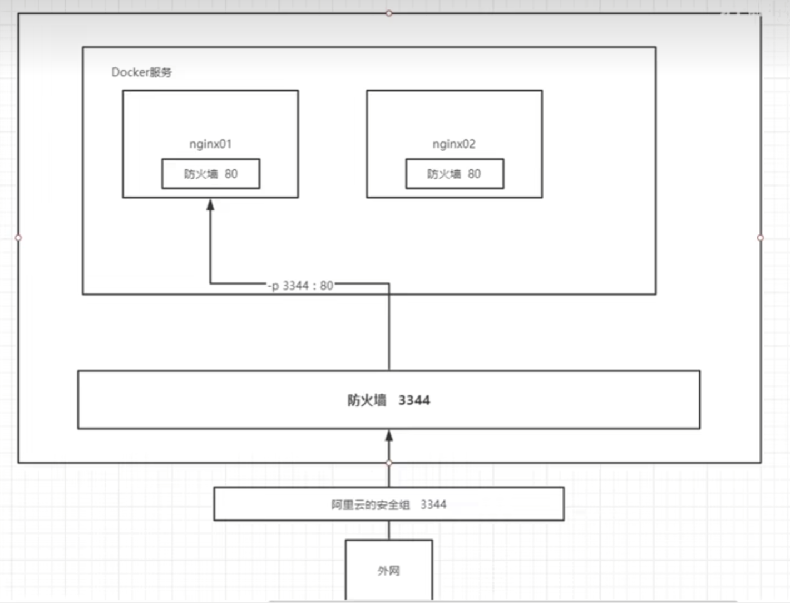

# 容器命令

### 新建容器并启动
docker run [可选参数] image
```
docker run [可选参数] image
# 参数说明
--name "name" 容器名字来区分容器
#例如 docker run -d --name test1 images 
这一步将此容器命名为test1
-d 后台方式运行
-it 使用交互方式运行，进入容器查看内容
-P(大写) 指定容器的端口，
例如：-P ip:主机端口：容器端口
      -P 主机端口：容器端口  （常用）
      -P 容器端口
      
-p（小写）随机指定端口


docker ps 查看当前运行的容器
# 可选项
-a 查看运行过的容器
-n=（数量） 显示最近创建几个的容器
-q 只显示容器id
-aq 显示所有容器的编号
-


root@ljr-vm:/home/ljr# docker ps -a
CONTAINER ID   IMAGE         COMMAND                  CREATED             STATUS                         PORTS     NAMES
8f8d165645ae   mysql         "docker-entrypoint.s…"   45 seconds ago      Exited (1) 36 seconds ago                youthful_roentgen
b0bc6d0310ea   hello-world   "/hello"                 About an hour ago   Exited (0) About an hour ago             thirsty_shannon
9000e99aeb5a   hello-world   "/hello"                 3 hours ago         Exited (0) 3 hours ago                   nostalgic_sanderson

```

# *附：端口暴露概念*

### 退出容器
```
exit  退出并停止容器
Ctrl+P+Q 容器不停止但退出

```

### 删除容器

```
docker rm 容器id
docker rm -f 容器id 强制删除
docker rm -f $(docker ps -aq) 删除所有容器

#通过管道操作：例如将所有正在后台运行的进程通过管道传输到docker rm,来全部删除容器
docker ps -a -q|xargs docker rm

```

### 启动和停止容器操作
```
docker start 容器id 启动容器
docker restart 容器id 重启
docker stop 容器id 停止当前运行容器
docker kill 容器id 强制停止
``` 

# 其他常用命令

```
docker run -d 镜像名   后台运行镜像

# 
root@localhost:/home/ljr# docker run -d centos
488994a3ab6e8abce17c7d10d302d4c260367c5918905845435b0fbd0c55c457  #后台运行容器id
root@localhost:/home/ljr# docker ps
CONTAINER ID   IMAGE     COMMAND   CREATED   STATUS    PORTS     NAMES  #查找之后并没有发现centos在运行

# 常见问题：容器在后台运行必须要有个前台进程，如果docker 发现没有应用就自动停止

```

## 查看日志
docker logs
```

docker logs -f -t --tail n 容器id

#可选项  
-f 或 --follow：持续输出日志，类似于 tail -f 的效果。
-t 或 --timestamps：在日志输出中显示时间戳。
--tail：仅输出日志文件的最后几行。默认情况下，--tail 需要一个数字来指定行数，但如果你只是单独使用 --tail 而没有跟数字，则大多数 Docker 客户端会默认显示最后几行（这个默认数量可能因 Docker 版本而异，有时可能是“all”，即所有日志）。
--tail n 显示n行
```

## 查看容器中进程信息
```
docker top 容器id

root@localhost:/home/ljr# docker ps
CONTAINER ID   IMAGE     COMMAND       CREATED          STATUS          PORTS     NAMES
c48da0412966   centos    "/bin/bash"   19 seconds ago   Up 19 seconds             busy_lalande
73f0cc307a48   centos    "/bin/bash"   26 seconds ago   Up 26 seconds             youthful_curie
root@localhost:/home/ljr# docker top c48da0412966
UID                 PID                 PPID                C                   STIME               TTY
TIME                CMD
root                5874                5855                0                   21:53               pts/0
00:00:00            /bin/bash
```

## 查看镜像的元数据
```
docker inspect 容器id

# # #

root@localhost:/home/ljr# docker inspect c48da0412966
[
    {
        "Id": "c48da04129665b06256e9ef81549dbfd4d03f7375e395a37e5ce827100bddce5",
        "Created": "2024-07-18T13:53:14.209228546Z",
        "Path": "/bin/bash",
        "Args": [],
        "State": {
            "Status": "running",
            "Running": true,
            "Paused": false,
            "Restarting": false,
            "OOMKilled": false,
            "Dead": false,
            "Pid": 5874,
            "ExitCode": 0,
            "Error": "",
            "StartedAt": "2024-07-18T13:53:14.249095539Z",
            "FinishedAt": "0001-01-01T00:00:00Z"
        },
        "Image": "sha256:5d0da3dc976460b72c77d94c8a1ad043720b0416bfc16c52c45d4847e53fadb6",
        "ResolvConfPath": "/var/lib/docker/containers/c48da04129665b06256e9ef81549dbfd4d03f7375e395a37e5ce827100bddce5/resolv.conf",
        "HostnamePath": "/var/lib/docker/containers/c48da04129665b06256e9ef81549dbfd4d03f7375e395a37e5ce827100bddce5/hostname",
        "HostsPath": "/var/lib/docker/containers/c48da04129665b06256e9ef81549dbfd4d03f7375e395a37e5ce827100bddce5/hosts",
        "LogPath": "/var/lib/docker/containers/c48da04129665b06256e9ef81549dbfd4d03f7375e395a37e5ce827100bddce5/c48da04129665b06256e9ef81549dbfd4d03f7375e395a37e5ce827100bddce5-json.log",
        "Name": "/busy_lalande",
        "RestartCount": 0,
        "Driver": "overlay2",
        "Platform": "linux",
        "MountLabel": "",
        "ProcessLabel": "",
        "AppArmorProfile": "",
        "ExecIDs": null,
        "HostConfig": {
            "Binds": null,
            "ContainerIDFile": "",
            "LogConfig": {
                "Type": "json-file",
                "Config": {}
            },
            "NetworkMode": "bridge",
            "PortBindings": {},
            "RestartPolicy": {
                "Name": "no",
                "MaximumRetryCount": 0
            },
            "AutoRemove": false,
            "VolumeDriver": "",
            "VolumesFrom": null,
            "ConsoleSize": [
                30,
                120
            ],
            "CapAdd": null,
            "CapDrop": null,
            "CgroupnsMode": "host",
            "Dns": [],
            "DnsOptions": [],
            "DnsSearch": [],
            "ExtraHosts": null,
            "GroupAdd": null,
            "IpcMode": "private",
            "Cgroup": "",
            "Links": null,
            "OomScoreAdj": 0,
            "PidMode": "",
            "Privileged": false,
            "PublishAllPorts": false,
            "ReadonlyRootfs": false,
            "SecurityOpt": null,
            "UTSMode": "",
            "UsernsMode": "",
            "ShmSize": 67108864,
            "Runtime": "runc",
            "Isolation": "",
            "CpuShares": 0,
            "Memory": 0,
            "NanoCpus": 0,
            "CgroupParent": "",
            "BlkioWeight": 0,
            "BlkioWeightDevice": [],
            "BlkioDeviceReadBps": [],
            "BlkioDeviceWriteBps": [],
            "BlkioDeviceReadIOps": [],
            "BlkioDeviceWriteIOps": [],
            "CpuPeriod": 0,
            "CpuQuota": 0,
            "CpuRealtimePeriod": 0,
            "CpuRealtimeRuntime": 0,
            "CpusetCpus": "",
            "CpusetMems": "",
            "Devices": [],
            "DeviceCgroupRules": null,
            "DeviceRequests": null,
            "MemoryReservation": 0,
            "MemorySwap": 0,
            "MemorySwappiness": null,
            "OomKillDisable": false,
            "PidsLimit": null,
            "Ulimits": [],
            "CpuCount": 0,
            "CpuPercent": 0,
            "IOMaximumIOps": 0,
            "IOMaximumBandwidth": 0,
            "MaskedPaths": [
                "/proc/asound",
                "/proc/acpi",
                "/proc/kcore",
                "/proc/keys",
                "/proc/latency_stats",
                "/proc/timer_list",
                "/proc/timer_stats",
                "/proc/sched_debug",
                "/proc/scsi",
                "/sys/firmware",
                "/sys/devices/virtual/powercap"
            ],
            "ReadonlyPaths": [
                "/proc/bus",
                "/proc/fs",
                "/proc/irq",
                "/proc/sys",
                "/proc/sysrq-trigger"
            ]
        },
        "GraphDriver": {
            "Data": {
                "LowerDir": "/var/lib/docker/overlay2/62dd7d056ec36212fe58cfd3f6dd19d2a046e016fa8dffd22d00d898fa9af70f-init/diff:/var/lib/docker/overlay2/ddc0858ff9fde0af20ec4fc2696a882e86ddc7d08a82982448e1c753fd2a62b9/diff",
                "MergedDir": "/var/lib/docker/overlay2/62dd7d056ec36212fe58cfd3f6dd19d2a046e016fa8dffd22d00d898fa9af70f/merged",
                "UpperDir": "/var/lib/docker/overlay2/62dd7d056ec36212fe58cfd3f6dd19d2a046e016fa8dffd22d00d898fa9af70f/diff",
                "WorkDir": "/var/lib/docker/overlay2/62dd7d056ec36212fe58cfd3f6dd19d2a046e016fa8dffd22d00d898fa9af70f/work"
            },
            "Name": "overlay2"
        },
        "Mounts": [],
        "Config": {
            "Hostname": "c48da0412966",
            "Domainname": "",
            "User": "",
            "AttachStdin": true,
            "AttachStdout": true,
            "AttachStderr": true,
            "Tty": true,
            "OpenStdin": true,
            "StdinOnce": true,
            "Env": [
                "PATH=/usr/local/sbin:/usr/local/bin:/usr/sbin:/usr/bin:/sbin:/bin"
            ],
            "Cmd": [
                "/bin/bash"
            ],
            "Image": "centos",
            "Volumes": null,
            "WorkingDir": "",
            "Entrypoint": null,
            "OnBuild": null,
            "Labels": {
                "org.label-schema.build-date": "20210915",
                "org.label-schema.license": "GPLv2",
                "org.label-schema.name": "CentOS Base Image",
                "org.label-schema.schema-version": "1.0",
                "org.label-schema.vendor": "CentOS"
            }
        },
        "NetworkSettings": {
            "Bridge": "",
            "SandboxID": "60d14899243e582ebb5cac0f396bc9fed8f13064ce0fc3050a475da719632d85",
            "SandboxKey": "/var/run/docker/netns/60d14899243e",
            "Ports": {},
            "HairpinMode": false,
            "LinkLocalIPv6Address": "",
            "LinkLocalIPv6PrefixLen": 0,
            "SecondaryIPAddresses": null,
            "SecondaryIPv6Addresses": null,
            "EndpointID": "f615e165cacc6e0b57c1cfdfcc8d530821ec3065fbf66fda73e5e08131e54bc7",
            "Gateway": "172.17.0.1",
            "GlobalIPv6Address": "",
            "GlobalIPv6PrefixLen": 0,
            "IPAddress": "172.17.0.3",
            "IPPrefixLen": 16,
            "IPv6Gateway": "",
            "MacAddress": "02:42:ac:11:00:03",
            "Networks": {
                "bridge": {
                    "IPAMConfig": null,
                    "Links": null,
                    "Aliases": null,
                    "MacAddress": "02:42:ac:11:00:03",
                    "DriverOpts": null,
                    "NetworkID": "2011c7d973b997578bf3b6101ba5a0979a50b5f1a4168e5a4bf44d83e7ada229",
                    "EndpointID": "f615e165cacc6e0b57c1cfdfcc8d530821ec3065fbf66fda73e5e08131e54bc7",
                    "Gateway": "172.17.0.1",
                    "IPAddress": "172.17.0.3",
                    "IPPrefixLen": 16,
                    "IPv6Gateway": "",
                    "GlobalIPv6Address": "",
                    "GlobalIPv6PrefixLen": 0,
                    "DNSNames": null
                }
            }
        }
    }
]
```

## 进入当前正在后台运行的容器

```
docker exec -it 容器id (/bash/Shell)
#进入容器后开启一个新的终端，可以在里面操作

docker attach 容器id
#进入容器正在执行的终端，不会启动新的进程
```

## 将容器内容复制到主机里
```
#格式
docker cp 容器id:要拷贝的文件路径 拷贝到主机的哪个文件路径
```

```
## 例如

#运行centos
root@localhost:/home/ljr# docker run -it centos
#在centos列出当前所有文件
[root@9d72e9735d7e /]# ls
bin  dev  etc  home  lib  lib64  lost+found  media  mnt  opt  proc  root  run  sbin  srv  sys  tmp  usr  var
#创建文件
[root@9d72e9735d7e /]# cd /home
[root@9d72e9735d7e home]# touch hello.c
[root@9d72e9735d7e home]# ls
hello.c
[root@9d72e9735d7e home]# exit
exit

root@localhost:/home/ljr# docker ps -a
CONTAINER ID   IMAGE         COMMAND       CREATED              STATUS                          PORTS     NAMES
9d72e9735d7e   centos        "/bin/bash"   About a minute ago   Exited (127) 6 seconds ago                vigorous_napier

#开始复制
root@localhost:/home/ljr# docker cp 9d72e9735d7e:/home/hello.c /home
Successfully copied 1.54kB to /home
#在主机上找到文件
root@localhost:/home/ljr# cd /home
root@localhost:/home# ls
hello.c  ljr


```


